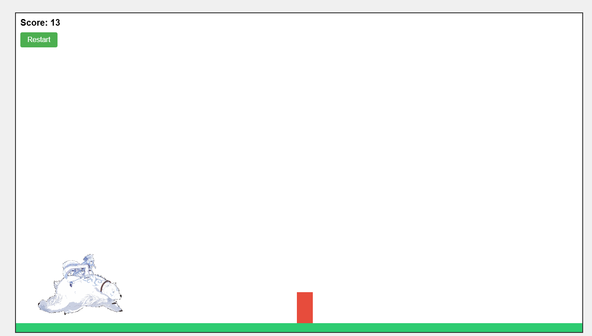

# Endless Runner Game

A simple 2D endless runner game built with JavaScript, HTML5, and CSS3 - developed with assistance from Claude 3.7 Sonnet Thinking.



## 🎮 About The Game

This project is a classic endless runner game where the player character automatically runs forward while the player's goal is to jump over obstacles. The longer you survive, the higher your score climbs!

### Built with Claude 3.7 Sonnet Thinking

This game was developed through an interactive collaboration with Claude 3.7 Sonnet. The AI assisted with:

- Code architecture design
- Implementation of game physics
- Sprite animation system
- Collision detection algorithms
- Refactoring for maintainability with constants
- Performance optimization suggestions

## 🕹️ How to Play

- **Objective**: Survive as long as possible by jumping over obstacles
- **Controls**: Click and hold the left mouse button to jump
  - Quick tap = small jump
  - Hold longer = higher jump (up to a maximum height)
- **Scoring**: Your score increases the longer you stay alive

## ✨ Features

- Variable jump height system based on button press duration
- Progressive difficulty with increasing game speed
- Optimized collision detection with forgiving hit boxes
- Sprite-based animations
- Centralized game constants for easy tweaking and balancing

## 🛠️ Technologies Used

- HTML5 Canvas for rendering
- Vanilla JavaScript for game logic
- CSS3 for styling
- Modular code architecture
- Sprite-based animation system

## 🚀 Getting Started

### Prerequisites

- A modern web browser (Chrome, Firefox, Safari, Edge)

### Installation

1. Clone the repository:
   ```
   git clone https://github.com/yourusername/endless-runner.git
   ```

2. Open `index.html` in your browser

Alternatively, you can play the game online at: [Game URL](#)

## 🧠 Technical Implementation

The game is structured with a modular approach:

- `js/constants.js`: Central configuration for all game parameters
- `js/core/`: Core engine components (Entity base class, Game engine)
- `js/entities/`: Game entities (Player, Obstacles, Background, Ground)
- `js/managers/`: Manager classes (Assets, Input, State)
- `js/states/`: Game states (Loading, Menu, Playing, GameOver)
- `js/systems/`: Game systems (Collision detection, Scoring)
- `js/ui/`: UI components (UI Manager)
- `js/utils/`: Utility functions for collision detection and more

## 🧪 Future Enhancements

- Additional obstacle types
- Power-ups and special abilities
- Background parallax effects
- Sound effects and music
- Mobile touch optimization
- Local high score tracking

## 🙏 Acknowledgments

- Claude 3.7 Sonnet Thinking for AI assistance in development
- Sprite assets from [source if applicable]
- Inspiration from classic endless runners like Temple Run and Subway Surfers

## 📝 License

This project is licensed under the MIT License - see the LICENSE file for details.